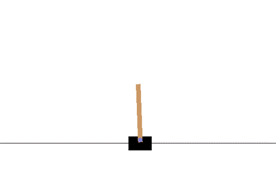
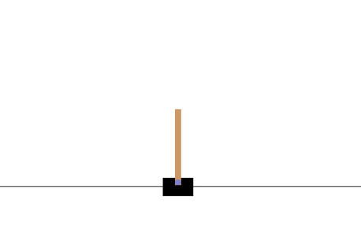

# Agents

A Reinforcement Learning library. Compatible with [`gym`](gym.openai.com).

Implements RL algorithms in a modular, documented, and extensible format.

|  |  |
|:---:|:---:|
| Illustration of a cartpole control problem solved using RL. |

---

*Note: Under active development.*